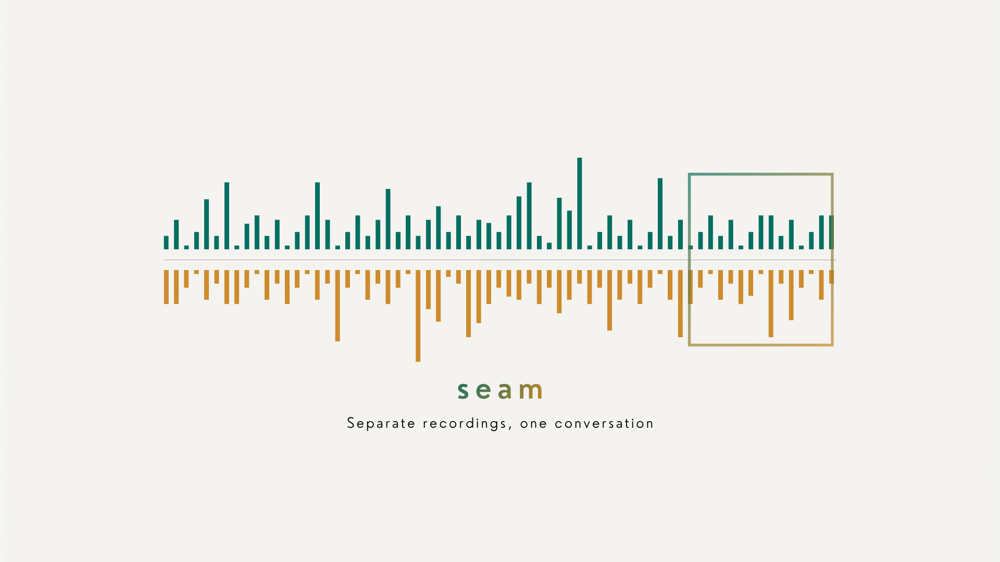
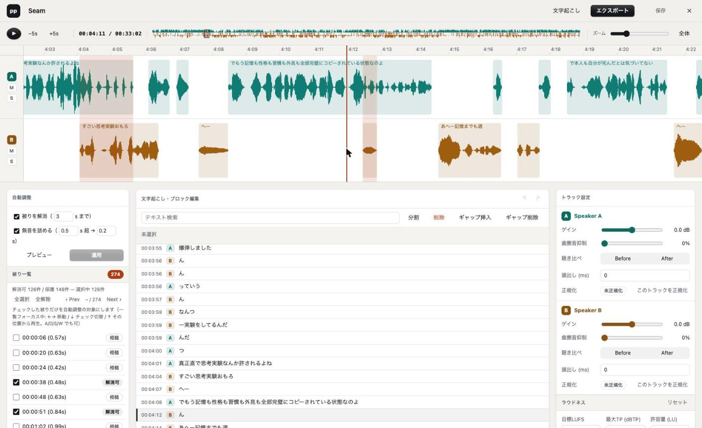
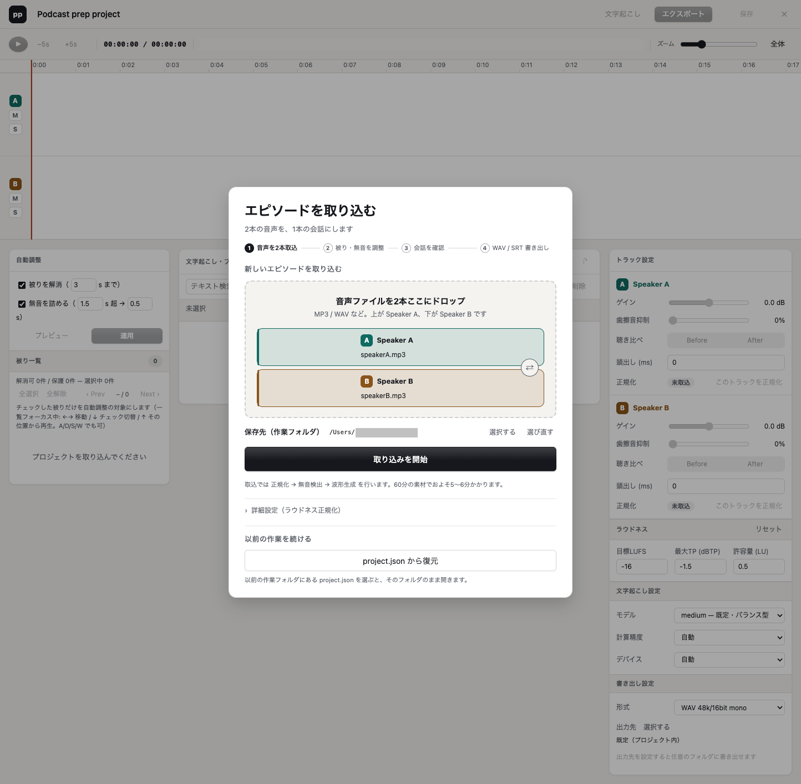
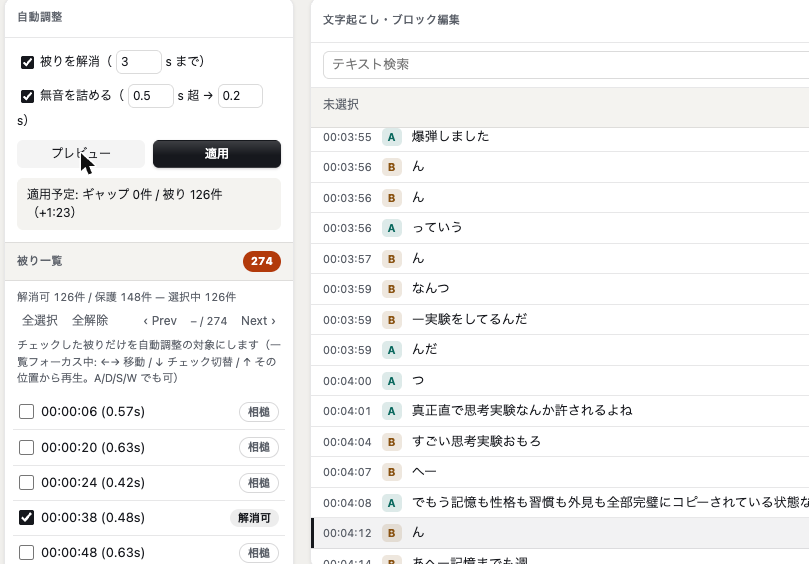
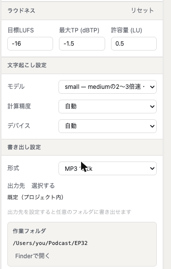

# seam



2話者がマイク別々に収録したPodcast素材（音声ファイル×2。MP3 / WAV / M4A / FLAC など）を、Premiere Pro での本編集前に整えるローカルWebアプリです。ラウドネス正規化から被り検出、クリップ式タイムライン編集、ローカル文字起こし、書き出しまでを1画面で行います。

名前の由来は、このツールが扱う対象そのもの — 2本の別録りのあいだにある**継ぎ目（seam）**、つまり被り・無音・頭出しのズレです。編集画面の中央には、エピソード全体の継ぎ目を1本の帯に圧縮した俯瞰（上=話者A / 下=話者B / 中央の線=被り）が常に表示されます。

音声ファイルは外部へ送信しません。文字起こしは faster-whisper のローカル実行で、UIも外部CDNを読み込まない完全ローカル構成です。

**このアプリには認証がありません。** 安全性は「サーバが `127.0.0.1` にしかバインドされていない = そのマシンからしか届かない」ことに依存しています。バインド先をループバック以外へ変える場合は、「環境変数」の `SEAM_HOST` の注意を必ず読んでください。

> **Status: 個人プロジェクト**
> 自分たちのPodcast収録に合わせて作った道具を公開しています。MIT ライセンスなので自由に使い、フォークし、改変してください。
> Issue / Pull Request は開いていますが、**対応や返信をお約束することはできません**（趣味の範囲で運用しているため）。
> 自分の環境に合わせて手を入れたい場合は、フォークが最も確実です。



*33分のエピソードを開いた状態。上が話者A・下が話者B、赤いハイライトが被り区間。左パネルに被り一覧（274件）、中央に波形同期の文字起こし、右にトラック設定。上部の細い帯がエピソード全体の俯瞰。*

## 機能

- **クリップ式波形編集** — VADで検出した発話ブロックをクリップとして表示。ドラッグ移動・分割・削除・ギャップ挿入/削除が波形表示にそのまま反映され、見えている編集状態がそのままエクスポート結果になります（WYSIWYG）
- **被り検出** — 2話者の発話が重なる区間を検出し、赤ハイライト+一覧表示。一覧の各行は「解消可 / 相槌 / 長尺 / 同時」に分類され、キー操作で解消可の箇所だけを順に確認できます
- **エピソード全体の俯瞰** — transport 中央のシグネチャー帯（上=A / 下=B の発話量、中央の縦線=被り、枠=表示中の範囲）で全体像を常に把握でき、クリックでその位置へ移動。「全体」ボタンで全編を1画面にフィットさせることもできます
- **自動調整（opt-in）** — 長い無音の詰めと被りの解消をチェックボックスで選び、dry-run プレビュー（対象区間のハッチ表示・件数・短縮秒）で確認してから適用。適用は Undo 1段で丸ごと戻せます。相槌（内包被り）や長い同時発話は自動対象外として理由つきで報告されます
- **波形同期文字起こしパネル** — 再生ヘッドに追従して現在行をハイライト。行クリックでジャンプ、テキストで絞り込み
- **頭出し整合** — Shift+ドラッグでトラック全体を前後にずらし、2本の録音開始ズレを合わせる（ms値をライブ表示）
- **ラウドネス正規化** — ffmpeg `loudnorm` の3パス（計測 → 適用 → 検証）で目標ラウドネスへ揃えます。目標LUFS・最大トゥルーピーク・許容量を指定でき、計測値が目標±許容量の範囲内なら正規化をスキップします（既にそろっている素材に無駄な処理をかけない）
- **ディエッサー** — トラック別の歯擦音抑制。Before / After を同一区間で比較試聴
- **エクスポート** — `speakerA` / `speakerB`（WAV 48kHz/16bit/mono、または MP3 320k / 192k。2本等長）、`overlaps.csv`（`start,end,duration`）、文字起こし済みなら `transcript.srt`（編集後タイムスタンプ）

## 要件

- Python 3.12+
- [uv](https://docs.astral.sh/uv/)
- ffmpeg / ffprobe

macOS で開発・常用しています。Windows でも動くように書いていますが、**手元に Windows 実機がないため実地検証ができていません**。動いた／動かなかったの報告を Issue でもらえると非常に助かります（フォルダ選択・Finder 相当の「エクスプローラーで開く」・パス区切りまわりが特に不安な箇所です）。

## セットアップ

```bash
uv sync
```

### Whisperモデルのセットアップ

ローカル文字起こしには faster-whisper 用の CTranslate2 モデルが必要です。次のスクリプトで一度だけダウンロードします（既定 `medium`、約1.5GB）。

```bash
bash scripts/fetch_whisper_model.sh                 # 既定: medium
bash scripts/fetch_whisper_model.sh --model large-v3
```

- **音声が外部送信されることはありません。ダウンロードされるのはモデル重みのみです**
- モデルは `<データディレクトリ>/models/faster-whisper-<モデル名>` に配置され、以後の文字起こしはオフラインで動きます
- 中断しても再実行すれば途中からレジュームされます
- **アプリの「文字起こし設定」パネルからも取得できます** — モデルのプルダウンで未取得のものを選ぶと、その場でダウンロードできます（進捗表示つき）。上のコマンドは事前に用意しておきたい場合に使ってください
- 同じパネルで**計算精度**（`int8` は macOS で高速・推奨）と**デバイス**も選べます。配置済みモデルのローカルパスを直接指定したい場合は、プルダウンの「カスタムパス…」を選びます

## 起動

```bash
uv run seam
```

ブラウザで `http://127.0.0.1:4520` を開きます。

## 作業フォルダ

このアプリは**プロジェクトごとに1つのフォルダ（作業フォルダ）を持ち、そこに全部を置きます**。取込時にどこを作業フォルダにするかを選び、以降は次のものがすべてそのフォルダに入ります。

| 中身 | 説明 |
|---|---|
| `project.json` | 編集状態（カット位置・設定・文字起こし） |
| 取り込んだ音源 | 原則そのままの名前で置かれます（特殊文字を含む名前や、既にあるファイルと衝突する場合は別名に倒れます） |
| `speakerX_normalized.wav` / `speakerX_peaks.u8` | 取込時に変換した音声（正規化ONなら正規化済み。OFFなら48kHz/monoへの形式変換のみ）と波形ピーク |
| `exports/` | 書き出し先を指定しなかったときの出力先 |

作業フォルダを消せばそのプロジェクトは丸ごと消えます。逆に、フォルダごと別の場所（別のディスク・別のマシン）へ移してもそのまま開けます。

作業フォルダに選べないのは**ルート直下**、**クラウド同期フォルダ**（iCloud Drive / Dropbox / Google Drive など）、そして**アプリのデータフォルダ内**（`SEAM_DATA_DIR`）です。同期クライアントが書き込み途中の中間WAVを掴むと project.json や音源が静かに壊れるため、入口で断っています。



*起動すると最初にこの画面が出ます。上のスロットが話者A、下が話者B。**保存先（作業フォルダ）を選ぶまで「取り込みを開始」は押せません** — 取り込んだものがどこへ行ったか分からなくなるのを防ぐためです。ラウドネス正規化は「詳細設定」の中（既定OFF）。以前の作業は下の「project.json から復元」から続けられます。*

## 基本操作

1. **取込**: A/B 2本の音声ファイル（MP3 / WAV / M4A / AAC / FLAC / OGG / Opus / AIFF）をスロットに入れ、**保存先（作業フォルダ）を選んで** `取り込みを開始`。保存先を選ぶまで開始ボタンは押せません。無音検出（VAD）→ 波形生成が走り、進捗はオーバーレイとトップバーに表示されます。

   ラウドネス正規化は「詳細設定」を開いて有効にします（**既定OFF**。60分素材だと数分余分にかかるため、まず編集を始めたい人向けの既定にしています）。目標LUFS・最大トゥルーピーク・許容量もここで指定できます。あとから「トラック設定 → このトラックを正規化」で掛け直せます。

2. **タイムライン編集**: 発話ブロックがクリップとして2トラックに並びます。
   - 空き領域・ルーラーのクリック = シーク／クリップのクリック = 選択（ダブルクリックで選択+シーク）
   - クリップをドラッグで移動（隣接クリップ端・再生ヘッドにスナップ、Alt で解除）
   - **Shift+ドラッグ** = トラック全体の頭出しオフセット調整（ms値ライブ表示。設定パネルの数値入力とも連動）
   - 右クリック: この位置で分割／ブロック削除／このギャップを詰める／ギャップ挿入・削除／ここから再生
   - キーボード: Space 再生/停止、S 再生ヘッド位置で分割、Delete 選択削除、⌘/Ctrl+Z Undo（20段。⇧⌘Z / Ctrl+Y で Redo）、←/→ ±5秒、+/− ズーム、0 先頭へ
   - 左端の M / S ボタンでトラックのミュート／ソロ（頭出しの耳確認に）
   - 「全体」ボタンでエピソード全編を1画面にフィット（もう一度押すと元のズームに戻ります）

3. **被り確認**: 被り区間は赤ハイライトと左パネルの一覧に表示されます。一覧にフォーカスがある状態では ←→（または A/D）で**解消可の箇所だけ**を順に移動、↓（S）でチェック切替、↑（W）でその位置から再生。相槌や同時発話は保護扱いでスキップされるので、判断が必要な箇所だけを追えます。

4. **自動調整**（左パネル先頭）: 「無音を詰める」「被りを解消」をチェックして閾値を設定 → `プレビュー` で対象区間がハッチ表示され件数・短縮秒が出ます → `適用`。⌘Z 1段で全戻しできます。チェックした被りだけが対象になります。

5. **トラック調整**: gain / deesser をトラック別に調整。Before / After で同一区間のディエッサー比較試聴ができます。ラウドネス設定（目標LUFS・最大TP・許容量）は両トラック共通で、ここから変更できます。

6. **文字起こし**: `文字起こし` で faster-whisper をローカル実行します。実行中も**同じプロジェクトの**タイムライン編集は続けられます（別プロジェクトの取り込み・書き出しは完了までできません）。結果は文字起こしパネルに波形同期で表示され、検索欄で絞り込めます。プロジェクトを閉じても処理は続き、完了すると通知が出ます。

7. **エクスポート**: 形式（WAV 48k/16bit mono / MP3 320k / MP3 192k）を選んで出力します。出力先は「選択する」ボタンから**ネイティブのフォルダ選択ダイアログ**で指定でき、未指定なら作業フォルダの `exports/` 直下に出ます。出力先に前回の成果物があるときは上書き確認が出ます。完了後は「Finderで開く」で出力先を開けます。

   書き出されるのは**成果物だけ**です。

   | ファイル | 内容 |
   |---|---|
   | `speakerA.wav` / `speakerB.wav`（または `.mp3`） | **納品物**（編集後・2本等長）。Premiere にはこれを読み込みます |
   | `overlaps.csv` | 被り一覧（`start,end,duration`） |
   | `transcript.srt` | 字幕。**文字起こし済みのときだけ**生成されます |

   `project.json` や中間ファイルは同梱されません。**編集を続けたいときは作業フォルダから開きます**（書き出したフォルダではなく）。なお API には素材と `project.json` を同梱する自己完結バンドル（`bundle=reeditable`）もありますが、UI からは選べません。



*`プレビュー` を押すと「適用予定」の件数と尺の変化が出ます。被り一覧の各行には分類チップ（解消可 / 相槌 / …）が付き、チェックを入れた被りだけが自動調整の対象になります。*

8. **開く / 復元**: 取込オーバーレイの「project.json から復元」で、以前の作業フォルダにある `project.json` を選びます。**開いたフォルダがそのまま作業フォルダになります**（どこかへコピーはしません）。フォルダごと別の場所へ移動していても開けます。

   既にプロジェクトがあるフォルダを**新規取込の保存先**に選んだ場合は「再開する / 上書きして取り込む / キャンセル」を聞かれます。「上書きして取り込む」は元に戻せません（このアプリが生成したファイルだけを削除し、あなたが置いた音源やサブフォルダには触れません）。

9. **閉じる**: `✕` で保存して閉じるほか、「編集を破棄して閉じる」で**開いた時点の状態まで巻き戻して**閉じられます（自動保存されている編集も戻ります）。



*ラウドネス（目標LUFS・最大TP・許容量）、文字起こしのモデル、書き出し形式と出力先はここで設定します。最下部に現在の作業フォルダのパスが常に表示され、「Finderで開く」でそのまま開けます。*

## 環境変数

| 変数 | 既定値 | 説明 |
|---|---|---|
| `SEAM_DATA_DIR` | `./.seam` | Whisperモデルとプロジェクト一覧（`projects.json`）の置き場所。取込時に作業フォルダを指定しなかった場合のプロジェクト保存先でもあります |
| `SEAM_EXPORT_DIR` | (未設定) | **書き出し先の「よく使うフォルダ」を固定したいとき**に設定します（例 `~/Podcast/exports`）。設定すると書き出し設定にこのフォルダが選択肢として常に現れます。**通常は設定不要**です — 「選択する」ボタンからフォルダを直接指定できます |
| `SEAM_HOST` | `127.0.0.1` | バインドアドレス。**既定のまま（localhost 専用）で使ってください**。ループバック以外にバインドすると、`0.0.0.0` / 具体IP のどちらであっても、**認証のない全APIがそのネットワークへ露出します**。Host / Origin 検証は実装されていますが、これは**ブラウザ経由の攻撃（DNS rebinding・CSRF）への緩和策であって、アクセス制御ではありません** — 詳しくは [SECURITY.md](SECURITY.md) を参照してください |
| `SEAM_PORT` | `4520` | ポート番号 |
| `SEAM_WHISPER_LOCAL_ONLY` | `1` | `1` でローカル配置済みモデルのみ使用（推奨）。`0` にするとモデル名の解決を faster-whisper の自動ダウンロードに委ねます（この場合も音声は外部送信されません） |
| `SEAM_WHISPER_DEVICE` | `auto` | faster-whisper の `device` |
| `SEAM_WHISPER_COMPUTE_TYPE` | `auto` | faster-whisper の `compute_type` |

## VAD選定理由

VAD は `webrtcvad` を採用しました。silero-vad は精度面で有利な場面がありますが、torch 依存が大きく、90分×2トラックをローカルWebアプリで扱う導入負荷が高くなります。このツールは「被り候補を可視化し、人間が編集判断する」用途なので、軽量でCPU実行が速く、16-bit PCM 48kHz に直接適用できる `webrtcvad` を優先しています。`webrtcvad` が未導入の場合も、アプリはローカルのエネルギー判定にフォールバックします。

## テスト

```bash
uv sync --extra dev
uv run pytest
node --test tests/js/*.test.mjs
```

Python テストは ffmpeg 不要の純ユニットが中心です（ffmpeg が必要なテストは未導入環境では自動スキップ）。JS テストは Node.js 22.7 以降の組み込みテストランナーで動き、外部依存はありません（`.js` の ES modules 構文検出に 22.7+ が必要です）。

## コントリビューションについて

冒頭のとおり個人プロジェクトのため、Issue / PR への対応や返信はお約束できません。それでも構わなければ歓迎します。

- **バグ報告**: 再現手順・素材の条件（尺・形式）・エラーメッセージがあると読み解けます
- **Windows での動作報告**: 上に書いたとおり実機検証ができていないので、成功も失敗も歓迎です
- **Pull Request**: `uv run pytest` と `node --test tests/js/*.test.mjs` が通る状態でお願いします（CI でも同じものが走ります）
- **設計の背景**: `SPEC.md` に仕様、`IMPLEMENTATION_NOTES.md` にモジュール構成と開発時の注意点があります。個々の実装判断の理由はコード内のコメントに書いてあります

大きく変えたい場合は、フォークして自分の道具にするのが最も自由で確実です。

## License

MIT License（[LICENSE](LICENSE) を参照）
